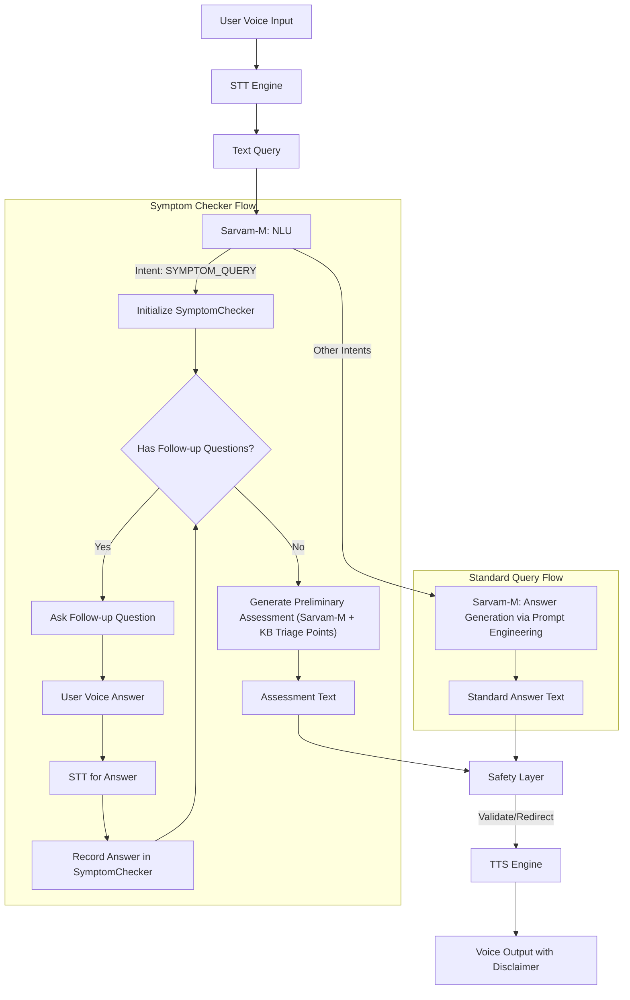

# Voice-Based Healthcare Q&A Application

## Abstract
A voice-based search and Q&A system for disseminating reliable healthcare information in Indian languages, leveraging Sarvam-M through advanced prompt engineering for accuracy and safety.

## Overview
This project, developed for DA 225o Deep Learning (Summer 2025), aims to provide accessible healthcare information to diverse Indian users through a voice interface, ensuring cultural relevance and safety.

## Project Motivation
Addresses the gap in reliable, language-accessible healthcare information in India, improving health literacy and awareness.
Key challenges in the Indian healthcare landscape include a skewed doctor-patient ratio, limited access to qualified medical advice in remote and rural areas, and significant linguistic diversity. This project specifically aims to mitigate these by:
*   Providing initial healthcare information and guidance in multiple Indian languages, reducing language as a barrier.
*   Offering a first point of contact for common health queries, potentially reducing the load on overwhelmed healthcare professionals for non-critical issues.
*   Improving health literacy by making information more understandable and accessible, particularly for users who might rely more on oral communication or have difficulty with text-based resources.

## Key Features
- Multi-language voice input/output (10 Indian languages).
- AI-driven responses for general healthcare questions via prompt-engineered Sarvam-M.
- Safety guardrails with disclaimers and emergency redirection.
- Interactive Symptom Checker with Preliminary Triage Advice.

## Databases Used

**Disease and symptoms dataset 2023**: Comprising ~246,000 entries, this synthetically generated dataset maps 773 diseases to 377 symptoms. It retains symptom severity and disease prevalence likelihood, enabling analysis of symptom-disease correlations and diagnostic significance. 
Source: Mendeley (https://data.mendeley.com/datasets/2cxccsxydc/1)

**Symptom-Disease Prediction Dataset (SDPD)**: This curated dataset offers structured associations between symptoms and diseases, guided by methodologies from institutions like the CDC. It integrates clinical literature, expert consensus, and observational data to support predictive healthcare research. 
Source: Mendeley (https://data.mendeley.com/datasets/dv5z3v2xyd/1)

## Technologies Used
- **Sarvam AI Platform**: Utilized for its comprehensive suite of AI services for Indian languages, including:
    - **Speech-to-Text (STT)**: For converting user's voice input in various Indian languages into text. (Leveraging Sarvam AI's Saarika v2 STT or similar models).
    - **Text-to-Speech (TTS)**: For synthesizing voice output from the generated text responses in a natural-sounding Indian voice.
    - **Large Language Model (Sarvam-M)**: For Natural Language Understanding (NLU) to interpret user queries, and for generating responses through sophisticated prompt engineering techniques. Sarvam-M's capabilities in handling Indian languages and generating contextually relevant, conversational text are key to the application's core logic, including symptom assessment summaries and general health information.

## Application Flow

The following diagram illustrates the workflow of the application:



## System Architecture Overview

The application integrates several key components to deliver a voice-based healthcare Q&A experience:

1.  **Voice Interface (STT/TTS)**: User interacts via voice. Sarvam AI services handle speech-to-text conversion of the user's query and text-to-speech for delivering the system's response.
2.  **NLU Processor (`nlu_processor.py`)**: The transcribed text query is processed by Sarvam-M to identify the user's intent (e.g., asking about a disease, describing symptoms) and extract relevant medical entities (symptoms, diseases, etc.).
3.  **Core Logic Orchestration (`main.py`)**: This script orchestrates the overall flow. Based on the NLU output, it decides whether to invoke the Symptom Checker or the standard prompt-based Q&A flow.
4.  **Symptom Checker (`symptom_checker.py`)**:
    *   If activated, this module manages an interactive dialogue to gather more details about the user's symptoms using predefined questions from `symptom_knowledge_base.json`.
    *   It then compiles this information and uses Sarvam-M to generate a preliminary assessment, which is further augmented by rule-based triage points from the local knowledge base.
5.  **Response Generation (Standard Queries - `response_generator.py`)**:
    *   For non-symptom related health queries, `response_generator.py` constructs a detailed prompt using the user's query and NLU output.
    *   This prompt is then sent to Sarvam-M, which generates an informed answer based on its general knowledge and the guidance provided in the system prompt (see `src/prompts.py`). This process relies on effective prompt engineering rather than external knowledge base retrieval for general queries.
6.  **Safety Layer**: All generated responses (from Symptom Checker or standard query responses) pass through a safety layer. This includes hardcoded checks for emergencies or diagnosis requests and ensures appropriate disclaimers are appended.
7.  **Knowledge Bases**:
    *   `symptom_knowledge_base.json`: A structured JSON file defining symptoms, keywords, follow-up questions, and basic triage points for the Symptom Checker.

## Symptom Checker and Triage

The application includes an interactive symptom checker to help users understand potential implications of their symptoms and receive general guidance.

**How it works:**
1.  **Activation**: If the NLU module identifies a user's query as relating to symptoms (e.g., "I have a fever and a cough"), the Symptom Checker is activated.
2.  **Interactive Q&A**: The checker may ask a series of follow-up questions based on the initially reported symptoms. These questions are drawn from the `symptom_knowledge_base.json` file. This step is interactive, requiring further voice input from the user for each question.
3.  **Preliminary Assessment**: Once sufficient information is gathered, the Symptom Checker generates a preliminary assessment. This involves:
    *   Sending the collected symptom details (initial query + answers to follow-ups) to the Sarvam-M model for a summarized interpretation and suggested next steps.
    *   Augmenting this with relevant `basic_triage_points` from the `symptom_knowledge_base.json`.
4.  **Output**: The user receives this assessment, which includes a summary, suggested severity, recommended general next steps, potential warnings, and relevant triage points from the knowledge base.

**Important Disclaimer**: The information provided by the symptom checker is for general guidance only and is **not a medical diagnosis**. Users are always advised to consult a qualified healthcare professional for any health concerns or before making any decisions related to their health. This disclaimer is consistently provided with any assessment.

## Project Structure

- `src/`: Contains the core application logic.
    - `main.py`: Main application script to run the voice-based Q&A.
    - `nlu_processor.py`: Handles Natural Language Understanding using Sarvam-M.
    - `response_generator.py`: Generates responses for standard queries using prompt engineering with Sarvam-M, guided by NLU output.
    - `symptom_checker.py`: Module for interactive symptom analysis and assessment generation.
    - `symptom_knowledge_base.json`: Configuration file for symptoms, keywords, and follow-up questions.
    - `audio_capture.py`: (Placeholder/Actual) For audio input and STT integration.
    - `tts_service.py`: (Placeholder/Actual) For Text-to-Speech integration.
- `tests/`: Unit tests for various components.
    - `test_nlu.py`: Unit tests for the NLU processor.
    - `test_symptom_checker.py`: Unit tests for the SymptomChecker class.
- `.env`: Stores API keys and other environment variables (not tracked by Git).
- `requirements.txt`: Lists project dependencies.
- `README.md`: This file.

## Setup and Usage

### Prerequisites
*   Ensure Python 3.8+ is installed.
*   Clone the repository: `git clone <repository-url>` 
*   Navigate to the project directory: `cd <repository-name>` 
*   Create a Python virtual environment (recommended):
    ```bash
    python -m venv venv
    source venv/bin/activate  # On Windows: venv\Scripts\activate
    ```
*   Install dependencies:
    ```bash
    pip install -r requirements.txt
    ```
*   Create a `.env` file in the project root. You can copy from `.env.example` if provided, or create it manually. Add your Sarvam API key:
    ```env
    SARVAM_API_KEY="your_actual_api_key_here"
    ```
    *(Obtainable from the Sarvam AI dashboard).*

### Running the Application (Streamlit UI)
The primary way to interact with the application is through the Streamlit UI.
```bash
streamlit run src/ui.py
```
Open your browser and go to `http://localhost:8501` (or the URL provided by Streamlit).

### CLI Mode (Core Logic Testing)
The `main.py` script offers a command-line interface, mainly for testing the core backend logic. It uses a mock STT by default and has limited interactivity compared to the Streamlit UI.
```bash
python main.py
```

### Important Notes for Voice Input:

*   **Microphone Permissions**: Users will need to grant microphone permissions to their browser for the voice input feature to work.
*   **HTTPS Required**: For browsers to allow microphone access, the application must be served over HTTPS. Streamlit Community Cloud provides this by default. If you are self-hosting in a way that results in an HTTP URL, voice input might not work on many browsers. Localhost is often an exception.

## Limitations

While this application aims to provide useful healthcare information, it has several limitations:

*   **Not a Diagnostic Tool**: The system, including the Symptom Checker, cannot provide medical diagnoses or replace consultation with qualified healthcare professionals. It offers general guidance only.
*   **Accuracy of STT/NLU**: The quality of the interaction heavily depends on the accuracy of the Speech-to-Text and Natural Language Understanding components, especially with diverse accents and complex queries.
*   **Knowledge Base Scope**: The effectiveness of responses for general queries depends on the LLM's training data, as RAG from an external medical KB is not used for these. The Symptom Checker relies on `symptom_knowledge_base.json`, which currently covers a limited set of common symptoms.
*   **LLM Hallucinations/Errors**: While prompt engineering aims to guide the LLM, there's always a possibility of generating incorrect or irrelevant information, especially for queries not covered by the symptom checker's specific logic. Safety layers and disclaimers are crucial.
*   **Complex Symptom Combinations**: The current Symptom Checker logic and LLM prompting for assessment are designed for common symptom presentations. Highly complex, rare, or subtly combined symptoms might not be interpreted adequately.
*   **No User Memory**: The system currently does not maintain user history or context across different sessions.

## Future Work

Several enhancements could further improve the application:

*   **Expanded Knowledge Bases**: Continuously update and expand `symptom_knowledge_base.json` with more symptoms, details, and languages/dialects. For general queries, explore re-introducing a refined RAG system if specific, curated knowledge is deemed necessary beyond the LLM's general capabilities.
*   **User Profiles and Personalization**: Allow users to create profiles to store preferences (language, etc.) and optionally, a secure health history for more personalized advice (with strong privacy safeguards).
*   **Integration with External Services**: Explore possibilities for integrating with services like appointment booking, medication reminders, or telemedicine platforms, with user consent.
*   **Enhanced NLU for Mixed Languages**: Improve handling of queries that mix English with Indian languages (Hinglish, Tanglish, etc.).
*   **UI/UX Improvements**: Enhance the Streamlit UI (if used) or develop a more robust mobile interface for wider accessibility.
*   **Refined Prompt Engineering**: Continuously refine system prompts for both general queries and the symptom checker to improve accuracy, tone, and safety of responses.
*   **Multi-turn Symptom Checking**: Develop a more dynamic multi-turn conversational ability for the symptom checker beyond the current scripted follow-up questions.
