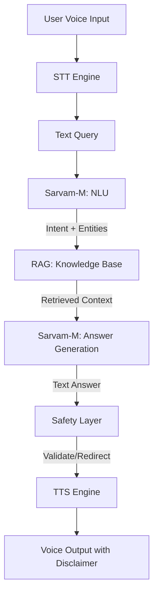

# Voice-Based Healthcare Q&A Application

## Abstract
A voice-based search and Q&A system for disseminating reliable healthcare information in Indian languages, leveraging Sarvam-M and RAG for accuracy and safety.

## Overview
This project, developed for DA 225o Deep Learning (Summer 2025), aims to provide accessible healthcare information to diverse Indian users through a voice interface, ensuring cultural relevance and safety.

## Project Motivation
Addresses the gap in reliable, language-accessible healthcare information in India, improving health literacy and awareness.

## Key Features
- Multi-language voice input/output (10 Indian languages).
- RAG-based retrieval from curated medical knowledge base.
- Safety guardrails with disclaimers and emergency redirection.

## Technologies Used
- Sarvam-M for NLU and answer generation.
- Google Cloud Speech-to-Text/TTS for voice processing.
- Sentence-BERT for knowledge base embeddings.

## Setup

1. Install dependencies: `pip install -r requirements.txt`
2. Create a `.env` file with `OPENAI_API_KEY`.
3. Run: `python src/app.py`
4. Run the Streamlit UI: streamlit run src/ui.py

## Project Structure

- [ ] `src/`: Application code.
- [ ] `tests/`: Unit tests.
- [ ] `.env`: API keys (not tracked).

## Application Flow

The following diagram illustrates the workflow of the "Thought of the Day" application:

